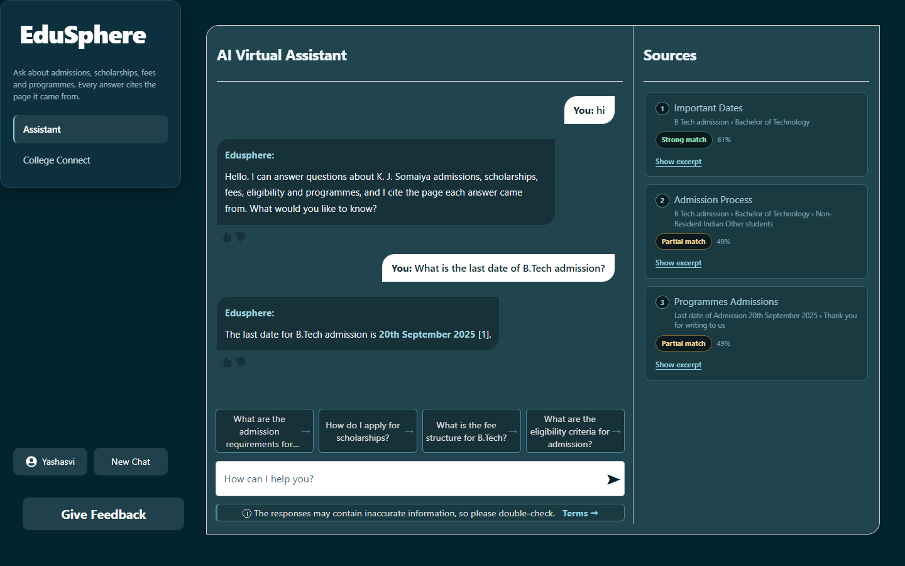

# 🎓 Edusphere: AI-Powered Educational Assistant


**Edusphere** is a full-stack, production-ready conversational AI platform designed to provide contextual educational assistance. By leveraging a custom **Retrieval-Augmented Generation (RAG)** pipeline powered by sentence transformers, Edusphere intelligently crawls, indexes, and retrieves institutional data to deliver highly accurate, source-backed responses to end users.



## ⚡ System Architecture

The project is built on a decoupled client-server architecture, ensuring high cohesion and low coupling:
- **Client Tier (Frontend)**: A highly responsive Single Page Application (SPA) built with **React** and **Vite**. It features localized state management, robust session persistence, and a modular component architecture.
- **Service Tier (Backend)**: A high-performance asynchronous REST API built with **FastAPI**. It handles NLP processing, vector embeddings, and real-time inference.
- **Data Layer**: A lightweight, schema-enforced JSON storage system designed for rapid prototyping, complete with transactional integrity for users, conversations, and feedback data.

## 🚀 Key Engineering Features

- **Custom RAG Pipeline**: Integrates `sentence-transformers` for semantic search across crawled institutional content, providing end-users with dynamic answers and exact source citations (complete with relevance scoring).
- **Intelligent Session Management**: Implements secure, persistent user sessions leveraging HTML5 `localStorage` and synchronized backend states.
- **Adaptive UI/UX**: Fully responsive, mobile-first design implemented with custom CSS. Features fluid flexbox/grid layouts, micro-animations, and dynamic height calculations for seamless cross-device rendering.
- **Telemetry & Feedback Loop**: Asynchronous tracking of user interactions, including granular message-level feedback (Like/Dislike with reasoning), enabling continuous model/response tuning.
- **Concurrent Startup Scripting**: Engineered a unified `.bat` executor that concurrently spins up isolated virtual environments, installs dependencies, and boots both servers instantly.

## 🛠️ Tech Stack

**Frontend Layer:**
- React 18, Vite
- Vanilla CSS (Mobile-First, Flexbox/Grid)
- React Router DOM, React Icons

**Backend Layer:**
- Python 3.x, FastAPI, Uvicorn
- Sentence Transformers (HuggingFace)
- Pydantic (Data Validation & Serialization)

## 🎯 How retrieval is kept honest

Two behaviours worth knowing about, because they are what separates a demo from
something usable:

**Answers are grounded, or there is no answer.** The LLM only ever sees passages
retrieved from the crawled corpus, and is instructed to answer from them alone.
Ask it the capital of Brazil and it says it does not know, rather than guessing.

**Weak matches are discarded, not shown.** A vector search always returns its top
*k* results however badly they match, so an unrelated message still comes back
with three confident-looking "sources". Anything below a cosine similarity of
`0.40` is dropped (`RELEVANCE_FLOOR` in `app.py`), and greetings skip retrieval
altogether. A genuine hit on this corpus scores around `0.60`; unrelated text
still scrapes `~0.49`, which is exactly why the floor is needed.

Each source is shown with a worded confidence — *Strong match* / *Partial match*
— rather than a bare percentage, because "49%" reads as failure when it is a
reasonable partial hit.

## 📦 Local Deployment

### 1. Clone and configure

```bash
git clone https://github.com/Yashvi2874/edusphere.git
cd edusphere
```

**Set an API key before anything else.** Without it the retrieval half still
works, but every reply falls back to a raw snippet instead of a written answer.

```bash
cd Edusphere_backend
cp .env.template .env      # Windows: copy .env.template .env
```

Then open `.env` and set `GEMINI_API_KEY`. A free key takes a minute at
[aistudio.google.com/apikey](https://aistudio.google.com/apikey) — Gemini's free
tier needs no card. `LITELLM_MODEL` selects the model and defaults to
`gemini/gemini-2.5-flash`; any provider LiteLLM supports works, including a local
Ollama model if you would rather not use a hosted one.

`.env` is gitignored. Never commit it.

### 2. Run it

```bash
# Windows — creates venvs, installs dependencies and starts both servers
start.bat
```

**Manual startup:**
* **Backend:** `cd Edusphere_backend && python -m venv .venv && .venv\Scripts\activate && pip install -r requirements.txt && python app.py`
* **Frontend:** `cd Edusphere_frontend && npm install && npm run dev`

> `requirements.txt` is a full environment freeze and installs a great deal you
> do not need. `requirements_simple.txt` has just the direct dependencies and is
> the faster path.

**Access points:**
- **Web application:** `http://localhost:3000`
- **REST API base:** `http://localhost:5001`
- **Swagger interactive API docs:** `http://localhost:5001/docs`

The frontend proxies `/api` to the backend (see `vite.config.js`), so both
development and production use the same fetch paths.

## 🗄️ Core API Reference

The system exposes a fully documented RESTful interface. Below are the primary endpoints:

| Endpoint | Method | Description |
|----------|--------|-------------|
| `/login` | `POST` | Authenticates user and provisions session |
| `/chat` | `POST` | Dispatches query to RAG pipeline & returns context |
| `/new_conversation` | `POST` | Initializes a clean conversation context thread |
| `/feedback` | `POST` | Ingests telemetry & user feedback for tuning |
| `/faqs` | `GET` | Retrieves dynamically categorized quick-actions |

## ⚠️ Known limitations

Stated plainly, because a reader will find them anyway:

- **Passwords are stored in plaintext** in `data/users.json` and compared with
  `==`. This is a demo authentication flow, not a secure one. Do not reuse a real
  password here.
- **Storage is JSON files**, not a database. Fine for a single instance;
  concurrent writes would not be.
- **The corpus is a point-in-time crawl** of K. J. Somaiya admissions and
  scholarship pages. Answers are only as current as the last crawl, so anything
  that matters should be confirmed on the official site.

## 🔮 Roadmap

- [ ] **Data layer**: move from the JSON file-store to PostgreSQL with SQLAlchemy.
- [ ] **Security**: bcrypt password hashing and JWT sessions, replacing the demo flow above.
- [ ] **Streaming**: token-by-token responses over WebSockets instead of a single POST.
- [ ] **Scheduled re-crawl**, so the corpus does not silently go stale.
- [ ] **Containerization**: `docker-compose` for frontend, backend and database.

---
*Engineered with precision by [Yashvi2874](https://github.com/Yashvi2874).*
